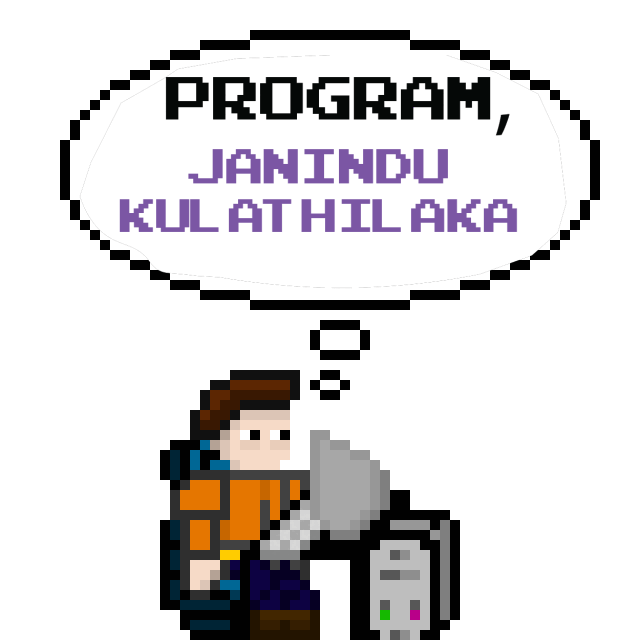

<h1 align="center">Hi 👋, I'm Janindu Kulathilaka</h1>
<h3 align="center">A passionate UI/UX Designer and Full-Stack Developer from Sri Lanka</h3>

  

  

- 👨‍🎓 I’m undergraduate computer science student at [University of Colombo School of Computing](https://ucsc.cmb.ac.lk/).

- 🔭 I’m currently working on [Wasana-Bakers-Bombuwala-Web-Application](https://github.com/GenZ-DevLabs/wasana-bakers-bombuwala-web-application)

- 🌱 I’m currently learning **Material UI, Advanced React**

- 🔗 This is our company [GenZ DevLabs](www.genzdevlabs.com).

<h3 align="left">Connect with me:</h3>

<h3 align="left">Languages and Tools:</h3>

 
   
   
   
   
  
   
    
   
   
   
   
   
   
  
   

&nbsp;

